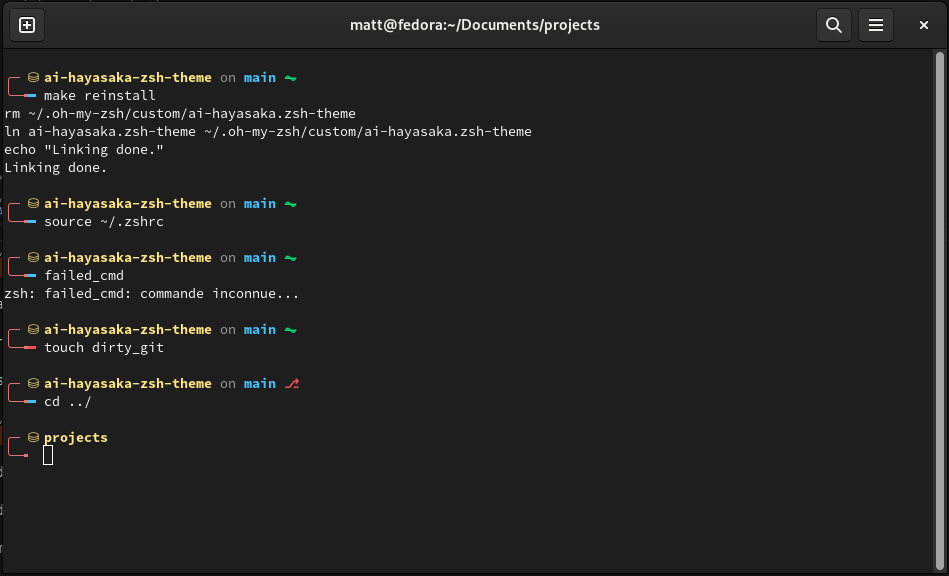
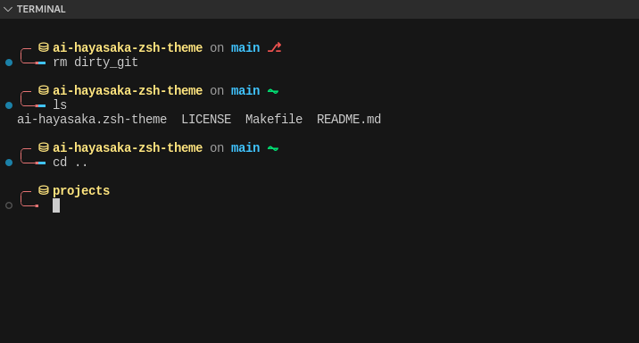

<!--
    ai-hayasaka.zsh-theme
        @copyright None
        @author Matthieu GOSSET
        @maintainers
            Matthieu GOSSET <matthieu.gosset.dev@outlook.com>
        @purpose None
        @usage
            Tested on `Fedora 38`.
            Tested with terminal theme of VSCode using `IBM Carbon Color Theme`
-->
# Ai-Hayasaka Theme

## Looks

## Purpose

Started shamelessly from `Fino` theme but with customizations I like.

More VSCode default colors adapted theme.

Tested on Fedora Terminal & VS Code w/ Dark+ & IBM Carbon Color Theme

## Changed

Add `\n` between commands.

Add more cool colors (from my pov, ofc).

Simplify customization by declaring a lot a vars.

## Personnalize

Lookout for the First sections in zsh-theme file to change color/chars as much as you want.

## Name

Why ?
Ai-Hayasaka is a cool caracter, with similar main colors.

## Makefile

- `install`: link zsh-theme into .oh-my-zsh folder, can be modified using `ZSH_CUSTOM=/path/to/anywhere`

- `clean`: remove target

- `reinstall`: remove then link again
